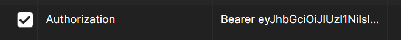

## Description

- This service is used to create shortUrls with an expiration date.
- It also provide detailed analytics like clicks, device, clientname.
- To access this service user needs to be register and logged in.
- A user can only access their own url,
  shorturl and analytics related to them.

## Installation

```bash
$ npm install
```

## Creating env file

```
JWT_EXPIRES=3d
JWT_SECRET=add_your_secret
EXPIRES_IN = Add_in_seconds
```

## Setting up the app

1. Install the packages`npm install`.
2. Create .env file.
3. Run the app with command `npm run start:dev`.
4. create new user - POST `localhost:3000/auth/signup` without body as -
   ```json
   {
     "name": "your_name",
     "email": "your_email",
     "password": "your_password"
   }
   ```
5. Login with the same creds as above step - GET `localhost:3000/auth/login` and body -
   ```json
   {
     "email": "your_email",
     "password": "your_password"
   }
   ```
6. Once logged in a token will be generated add this token in Authentication header of the urls.
   
7. To get short url use POST `localhost:3000/url-shortener/` with body as
   ```json
   {
     "fullUrl": "www.google.com"
   }
   ```
8. To get full url using shortUrl `localhost:3000/url-shortener:shortUrl`.
9. To get short url use GET `localhost:3000/url-shortener/analytics` with body as

   ```json
   {
     "shortUrl": ""
   }
   ```

## Running the app

```bash
# development
$ npm run start

# watch mode
$ npm run start:dev

# production mode
$ npm run start:prod
```

## Test

```bash
# unit tests
$ npm run test

# e2e tests
$ npm run test:e2e

# test coverage
$ npm run test:cov
```
